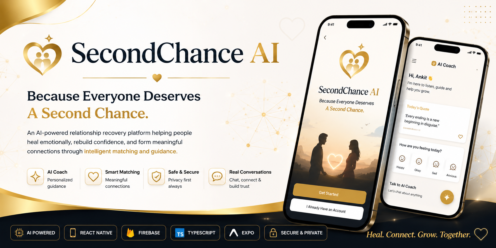

<div align="center">


# ❤️ SecondChance AI

### *Because Everyone Deserves A Second Chance.*

<p align="center">
An AI-powered relationship recovery platform helping people heal emotionally, rebuild confidence, and form meaningful connections through intelligent matching and personalized AI guidance.
</p>



<br>


</div>

---

# 🌍 About SecondChance AI

SecondChance AI is an AI-powered relationship recovery and intelligent matchmaking platform designed to help people confidently begin a new chapter in life.

Unlike traditional dating applications, SecondChance AI focuses on emotional healing, meaningful compatibility, and AI-guided conversations before connecting people with potential matches.

Whether someone is divorced, widowed, separated, or simply looking for a meaningful relationship, SecondChance AI provides a safe and intelligent environment where everyone gets another opportunity to find happiness.

---

## ✨ Vision

To build the world's most trusted AI-powered relationship recovery platform that combines emotional wellness, intelligent matchmaking, and meaningful human connections.

---

## 🎯 Mission

Empower people to rebuild confidence, heal emotionally, and create genuine relationships through ethical Artificial Intelligence.
---

# ✨ Why SecondChance AI?

Traditional dating applications focus primarily on swiping and appearance. SecondChance AI takes a completely different approach by combining **Artificial Intelligence**, **emotional wellness**, and **meaningful compatibility** to help users build healthier and more authentic relationships.

Our goal isn't simply helping people find matches—it's helping them heal, grow, and confidently begin a new chapter.

---

# 🚀 Core Features

### 🤖 AI Relationship Coach

- Personalized AI guidance
- Emotional support conversations
- Daily motivational insights
- Relationship advice
- Confidence building

---

### ❤️ Intelligent Matching

- Compatibility-focused matching
- Personalized recommendations
- Preference-based discovery
- Relationship goals alignment
- Interest-based suggestions

---

### 💬 Smart Conversations

- Real-time messaging
- Safe communication
- AI-powered conversation assistance
- Future-ready smart reply suggestions

---

### 👤 Personalized Profiles

- Beautiful onboarding experience
- Lifestyle preferences
- Personal values
- Interests & hobbies
- Relationship goals
- AI personality insights

---

### 🔐 Privacy & Safety

- Secure Firebase Authentication
- Privacy-first profile management
- Transparent Terms & Privacy Policy
- Contact & Support center
- Safe user experience

---

# 📱 Core Modules

| Module | Description |
|---------|-------------|
| 🔐 Authentication | Secure Login & Signup using Firebase Authentication |
| 👤 Smart Onboarding | AI-ready personalized profile creation |
| 🤖 AI Coach | Personalized relationship guidance and emotional support |
| ❤️ Discover | Browse intelligent compatibility-based recommendations |
| 💬 Chat | Real-time messaging experience |
| 💞 Matches | View meaningful connections |
| ⚙️ Profile Management | Edit profile, interests, lifestyle and preferences |
| 📞 Contact & Support | Built-in support center for users |
| 📄 About, Privacy & Terms | Complete legal and product information |

---

# 🌟 What Makes SecondChance AI Different?

| SecondChance AI | Traditional Dating Apps |
|-----------------|--------------------------|
| 🤖 AI Relationship Coach | ❌ |
| ❤️ Emotional Recovery Focus | ❌ |
| 🎯 Compatibility-Based Matching | ⚠️ Limited |
| 🧠 AI-Guided Onboarding | ❌ |
| 🔐 Privacy-First Experience | ⚠️ Basic |
| 🌱 Personal Growth Approach | ❌ |
| 💬 AI-Assisted User Journey | ❌ |

---

# 💡 Built With

- ⚛️ React Native
- 🚀 Expo
- 🔥 Firebase Authentication
- 🔥 Cloud Firestore
- 📘 TypeScript
- 🎨 Custom UI Components
- 🤖 AI-powered Architecture
- ❤️ User-Centered Design
---

# 📸 Application Preview

> **Beautiful. Intelligent. Human-Centered.**

### 🔐 Authentication

- Secure Login
- Modern Signup
- Premium Loading Experience

---

### 👤 Smart Onboarding

- User Type Selection
- Personal Information
- Interests & Lifestyle
- AI Personality Questions
- Profile Completion

---

### ❤️ Main Experience

- AI Coach
- Discover
- Matches
- Chat
- Profile
- Edit Profile
- Contact & Support

> 📷 Screenshots will be added inside the `assets/screenshots` folder.

---

# 🏗️ System Architecture

```text
                    User
                      │
                      ▼
          React Native (Expo)
                      │
      ┌───────────────┼───────────────┐
      ▼               ▼               ▼
 Firebase Auth   Cloud Firestore   AI Services
      │               │               │
      └───────────────┼───────────────┘
                      ▼
          SecondChance AI Platform
                      │
      ┌───────────────┼────────────────┐
      ▼               ▼                ▼
 AI Coach        Discover         Smart Matching
      │               │                │
      └───────────────┼────────────────┘
                      ▼
              Real-Time Experience
```

---

# 📂 Project Structure

```text
SecondChance-AI
│
├── assets
│   ├── banner
│   ├── logo
│   └── screenshots
│
├── docs
│
├── src
│   ├── components
│   ├── firebase
│   ├── navigation
│   ├── screens
│   ├── services
│   ├── theme
│   ├── types
│   └── utils
│
├── App.tsx
├── package.json
├── README.md
└── LICENSE
```

---

# ⚙️ Installation

## Clone Repository

```bash
git clone https://github.com/zerowingg/SecondChance-AI.git
```

---

## Install Dependencies

```bash
npm install
```

---

## Start Development Server

```bash
npx expo start
```

---

## Firebase Configuration

Create your Firebase project and configure:

- Firebase Authentication
- Cloud Firestore
- Storage (Optional)

Update:

```text
firebase/config.ts
```

with your Firebase credentials.

---

# 🛠 Tech Stack

| Category | Technology |
|----------|------------|
| Mobile | React Native |
| Framework | Expo |
| Language | TypeScript |
| Backend | Firebase |
| Database | Cloud Firestore |
| Authentication | Firebase Auth |
| AI Layer | AI Coach Services |
| UI | Custom Components |
| Navigation | React Navigation |
---

# 🧠 AI Experience

SecondChance AI is designed around a human-centered AI philosophy.

Instead of replacing human relationships, AI acts as a supportive companion that helps users become more confident, emotionally aware, and better prepared for meaningful connections.

The platform guides users throughout their journey—from onboarding to matchmaking—using intelligent recommendations and personalized experiences.

---

# 🔄 User Journey

```text
Create Account
      │
      ▼
Smart AI Onboarding
      │
      ▼
Complete Personalized Profile
      │
      ▼
AI Understands User Preferences
      │
      ▼
Discover Compatible People
      │
      ▼
Build Meaningful Connections
      │
      ▼
AI Coach Supports Personal Growth
```

---

# 🤖 AI Workflow

```text
User Input
     │
     ▼
Profile Analysis
     │
     ▼
Interest & Preference Mapping
     │
     ▼
Compatibility Logic
     │
     ▼
AI Coach Guidance
     │
     ▼
Personalized User Experience
```

---

# 🔐 Privacy & Security

SecondChance AI is designed with user privacy as a core principle.

### Security Features

- 🔐 Firebase Authentication
- 🔥 Secure Cloud Firestore
- 🛡️ Privacy-first architecture
- 📄 Transparent Privacy Policy
- 📞 Built-in Contact & Support
- 🚫 No unnecessary personal data collection
- 👤 Users remain in control of their profiles

---

# ⚡ Performance Highlights

- Fast React Native interface
- Expo optimized development
- Lightweight UI components
- Smooth onboarding experience
- Reusable component architecture
- Scalable Firebase backend
- Modular TypeScript codebase

---

# 🎨 Design Philosophy

The visual identity of SecondChance AI is inspired by hope, trust, and new beginnings.

### Brand Colors

- 🟡 Gold → Hope & New Opportunities
- ⚪ White → Trust & Simplicity
- ⚫ Dark Accents → Premium Experience

Every screen has been designed to create a calm, welcoming, and emotionally positive experience.

---

# 💎 Highlights

- ❤️ Premium User Experience
- 🤖 AI-Powered Guidance
- 🎯 Meaningful Compatibility
- 🔐 Secure Authentication
- 📱 Modern Mobile UI
- ⚡ Fast Performance
- 🌱 Human-Centered Design
- 🚀 Built during AMD AI Hackathon 2026
---

# 🚀 Future Vision

SecondChance AI is more than a relationship platform—it is our vision of an AI-powered companion that helps people heal, grow, and build meaningful human connections.

Our long-term goal is to create an intelligent ecosystem where Artificial Intelligence supports emotional well-being while always keeping people in control.

The following roadmap represents our long-term vision and is **not part of the current hackathon implementation**.

---

# 🛣 Product Roadmap

## ✅ Version 1.0 (Current Hackathon Release)

- Secure Authentication
- Smart Onboarding
- AI Coach
- Discover
- Matches
- Chat
- Profile Management
- Contact & Support
- Privacy & Terms
- Responsive Mobile UI

---

## 🔜 Version 1.5

- AI Compatibility Score
- AI Conversation Suggestions
- Smart Ice Breakers
- Enhanced Match Recommendations
- Profile Verification
- Better Search & Filters

---

## 🚀 Version 2.0

- 🎙 Voice AI Coach
- 😊 Emotion-Aware AI Conversations
- 🌍 Multi-language Support
- 📅 AI Date Planner
- 🎯 Personalized Relationship Goals
- 💬 AI Conversation Analysis

---

## 🌟 Version 3.0

- 📹 Video Profiles
- 🤝 Video Calling
- ❤️ Relationship Health Dashboard
- 🧠 AI Emotional Wellness Companion
- 🌐 Web Platform
- 💎 Premium Membership

---

# 🌍 Long-Term Vision

We believe Artificial Intelligence should strengthen human relationships—not replace them.

SecondChance AI aims to become a trusted companion that helps people:

- Build confidence
- Heal emotionally
- Communicate better
- Make healthier relationship decisions
- Form meaningful long-term connections

---

# 📈 Scalability

The architecture has been designed with future expansion in mind.

Potential future integrations include:

- AI APIs
- Cloud Functions
- Push Notifications
- Video Communication
- Real-Time Presence
- Recommendation Engine
- Analytics Dashboard
- Premium Subscription Services

---

# 💡 Why SecondChance AI?

Instead of focusing only on matching people, SecondChance AI focuses on helping people become emotionally stronger before building new relationships.

Our philosophy is simple:

> **Healthy people build healthy relationships.**

Artificial Intelligence is used as a supportive guide—not as a replacement for genuine human connection.

---

# ❤️ Our Motto

> **Because Everyone Deserves A Second Chance.**
---

# 👨‍💻 Founder

<div align="center">

## Ankit Anurag

**Student Developer • Founder of SecondChance AI**

Passionate about Artificial Intelligence, mobile app development, and building technology that creates meaningful real-world impact.

SecondChance AI was designed and developed as part of the **AMD AI Hackathon 2026**, with the vision of helping people rebuild confidence, heal emotionally, and create meaningful relationships through responsible AI.

*"Age should never limit innovation. Great ideas can come from anyone."*

</div>

---

# 📬 Contact

📧 Official Project Email

**secondchanceaiofficial@gmail.com**

---

📧 Founder

**ankitanurag383@gmail.com**

---

🐞 Bug Reports & Feature Requests

If you discover a bug or have ideas to improve SecondChance AI, we'd love to hear from you.

Please open a GitHub Issue or contact us through email.

---

# 📱 Connect With Us

GitHub Repository

https://github.com/zerowingg/SecondChance-AI

Instagram

Coming Soon

Website

Coming Soon

---

# 🙏 Acknowledgements

Special thanks to:

- AMD AI Hackathon
- React Native
- Expo
- Firebase
- TypeScript
- Open Source Community
- Everyone who believes technology should help people build healthier relationships.

---

# ❤️ Support This Project

If you enjoyed this project, please consider giving the repository a ⭐ on GitHub.

Your support motivates us to continue building meaningful AI-powered products.

---

# 📜 License

This project is released under the **MIT License**.

See the LICENSE file for more details.
---

# 🤝 Contributing

Contributions, ideas, and constructive feedback are always welcome.

If you'd like to contribute to SecondChance AI:

1. Fork the repository
2. Create a feature branch
3. Commit your changes
4. Push your branch
5. Open a Pull Request

Please ensure your code follows the project's coding style and is well documented.

---

# 🛡️ Security

Security and user privacy are fundamental to SecondChance AI.

If you discover a security vulnerability, please **do not** disclose it publicly.

Instead, contact us directly at:

📧 **secondchanceaiofficial@gmail.com**

We appreciate responsible disclosure and will investigate every report.

---

# 📝 Changelog

### Version 1.0.0 — AMD AI Hackathon Edition

#### Added

- Secure Firebase Authentication
- Premium User Onboarding
- AI Coach
- Discover Screen
- Matches Screen
- Chat Module
- Profile Management
- Edit Profile
- Contact & Support
- About Screen
- Privacy Policy
- Terms & Conditions
- Premium Loading Experience
- Professional GitHub Documentation

---

# 📊 Project Status

| Module | Status |
|---------|:------:|
| Authentication | ✅ |
| Smart Onboarding | ✅ |
| AI Coach | ✅ |
| Discover | ✅ |
| Matches | ✅ |
| Chat | ✅ |
| Profile | ✅ |
| Contact & Support | ✅ |
| Privacy & Terms | ✅ |
| Documentation | ✅ |

---

# 🎯 Built For

🏆 AMD AI Hackathon 2026

SecondChance AI demonstrates how Artificial Intelligence can be used responsibly to create meaningful human-centered experiences.

Our focus is not only technology—but also empathy, trust, and emotional well-being.

---

# 🌟 If You Like This Project...

Please consider giving this repository a ⭐ on GitHub.

Every star motivates future development and supports open-source innovation.

---

<div align="center">

## ❤️ Thank You

### Because Everyone Deserves A Second Chance.

Made with ❤️ using React Native, Firebase and Artificial Intelligence.

</div>
---

# 🎥 Demo

A complete walkthrough of SecondChance AI will be available soon.

> 📹 Demo Video: *Coming Soon*

The demonstration showcases:

- User Registration & Login
- AI-Powered Onboarding
- AI Coach
- Discover
- Matches
- Chat
- Profile Management
- Contact & Support

---

# 📸 Application Screenshots

> Screenshots are available inside:

```text
assets/screenshots/
```

### Authentication

- Login
- Signup

### Smart Onboarding

- User Type
- Basic Information
- Interests
- Lifestyle
- Values
- AI Questions
- Profile Photo

### Main Application

- Discover
- Matches
- AI Coach
- Chat
- Profile
- Edit Profile
- Contact & Support

---

# 📈 Future Improvements

The current hackathon version demonstrates the core vision of SecondChance AI.

Future development may include:

- 🎙 AI Voice Coach
- 🤖 Advanced AI Compatibility Engine
- 😊 Emotion Analysis
- 🌍 Multi-language Translation
- 📹 Video Profiles
- 📞 Voice & Video Calling
- 💎 Premium Membership
- 🌐 Web Platform
- 📊 Relationship Insights Dashboard
- 🛡 AI Scam Detection

---

# 🏅 Hackathon Submission

Project Name

**SecondChance AI**

Event

**AMD AI Hackathon 2026**

Category

**Artificial Intelligence • Mobile Application**

Platform

**React Native + Expo**

Backend

**Firebase**

Language

**TypeScript**

---

# 📂 Repository

GitHub

https://github.com/zerowingg/SecondChance-AI

---

<div align="center">

# ❤️ SecondChance AI

### Because Everyone Deserves A Second Chance.

---

**Designed & Developed by**

## Ankit Anurag

**Student Developer • Founder of SecondChance AI**

Built with ❤️ for the AMD AI Hackathon 2026.

If you enjoyed this project, please consider giving it a ⭐.

</div>